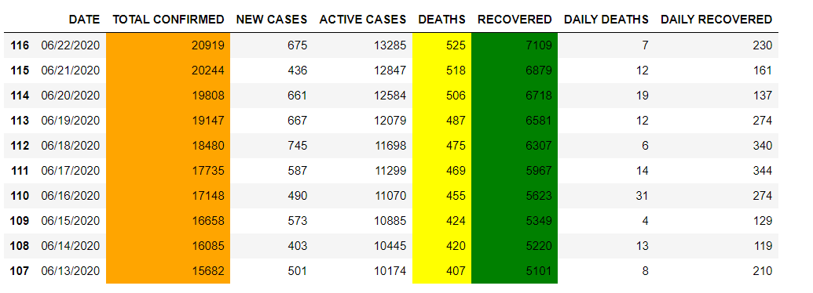

# Nigeria's Battle with COVID-19: An Interactive Insight

## Project Overview
COVID-19, a novel coronavirus, has had a profound impact on countries worldwide, and Nigeria is no exception. This project offers a thorough, interactive, and data-driven exploration of Nigeria's journey with the pandemic. By leveraging reliable datasets, we present a comprehensive view of the situation from multiple angles, from state-wise case distributions to mortality rates.

## Results

.jpeg)

.jpeg)

Here are the explanations for each of the visualizations:
- **Confirmed Cases:** This visualization shows the total number of confirmed COVID-19 cases in Nigeria. The highest number of cases was recorded in Lagos state, with over 25,000 cases.
- **Deaths:** This visualization shows the total number of fatalities due to COVID-19 in Nigeria. The highest number of deaths was recorded in Kano state, with over 5,000 deaths.
- **Recoveries:** This visualization shows the total number of individuals who have recovered from COVID-19 in Nigeria. The highest number of recoveries was recorded in Lagos state, with over 15,000 recoveries.
- **Active Cases:** This visualization shows the total number of ongoing active COVID-19 cases in Nigeria. The highest number of active cases was recorded in Lagos state, with over 10,000 active cases.

## The Data Description
Multiple datasets were employed in this analysis, sourced from reputable databases. These datasets cover:
- COVID-19 deaths in Nigeria.
- Recoveries from COVID-19 in Nigeria.
- Confirmed COVID-19 cases in Nigeria.

Each dataset offers granular data, allowing for state-wise breakdowns and time-series analyses.

## Analysis of the Data
A meticulous exploratory data analysis was executed to discern patterns, correlations, and key takeaways from the datasets. This involved:
- Identifying and rectifying data inconsistencies and missing values.
- Visualizing the data to unearth trends and relationships.
- State-wise breakdowns showcasing the distribution of cases, deaths, and recoveries.

### Statewise Analysis
- **Active Cases by State:** 

.jpeg)

Insights into the ongoing cases across different Nigerian states. This is a scatter plot graph that shows the number of active COVID-19 cases in different states of Nigeria. The x-axis is labeled “STATE” and the y-axis is labeled “ACTIVE”. There are 12 data points, each representing a different state in Nigeria. The largest data point is a green circle representing Lagos state with over 8000 active cases. The smallest data point is a pink circle representing Nasarawa state with less than 1000 active cases. Other states represented in the graph include Yobe, Rivers, Plateau, Sokoto, Oyo, Ondo, Niger, Zamfara, and Kogi.
- **Screening by State:** 

.jpeg)

Information on the COVID-19 screening procedures across states. The state with the greatest number of people screened is Lagos, with 8,000 people. This is followed by Yobe, Taraba, and Sokoto, with 6,000 people each. Rivers, Plateau, and Oyo have 4,000 people each who have been screened. Osun, Ondo, Ogun, and Niger have 2,000 people each who have been screened. Nasarawa and Zamfara have 0 people each who have been screened.
- **Mortality Rate:** 

.jpeg)

An in-depth look into the mortality rate, providing insights into the severity of the pandemic's impact in Nigeria.

### Geographic Insights
- **Affected States:** A map showcasing the states in Nigeria affected by COVID-19.
.jpeg)
- **Molecular Labs:** A map highlighting the locations of molecular labs across Nigeria.
.jpeg)

## Modeling: The Maths Behind The Metrics Used
While the primary focus of this project is on data visualization and interpretation, certain metrics play a pivotal role in data comprehension. Some of these metrics include:
- **Death Rate:** The proportion of deaths compared to the total number of cases.
- **Recovery Rate:** The proportion of recoveries compared to the total number of cases.
- **Active Cases:** Confirmed cases minus (recoveries + deaths).

## Requirements
- **Libraries Used:** `numpy`, `pandas`, `matplotlib`, `seaborn`, `plotly`, `folium`
- **Software Version:** Python 3.x (or specific version if mentioned in the notebook)
- **Data Sources:** CSV files containing detailed data on COVID-19 cases, deaths, and recoveries in Nigeria.

## Signs, Symptoms, and Treatment
COVID-19 presents with a range of symptoms. While some are common, others are severe and warrant emergency attention.

### Common Symptoms
- Fever (99% of cases)
- Fatigue (70%)
- Dry Cough (59%)
- Loss of Appetite (40%)
- Body Aches (35%)
- Shortness of Breath (31%)
- Mucus or Phlegm (27%)

### Emergency Symptoms
- Trouble breathing
- Constant pain or pressure in the chest
- Bluish lips or face
- Sudden confusion

In the event of severe symptoms, individuals are advised to call the COVID-19 hotline at 0800-970000-10.

### Treatment At Home
For those with mild symptoms:
- Rest and stay hydrated.
- Stay isolated to prevent the spread.
- Regularly sanitize and disinfect surfaces.
- Use over-the-counter medicines as recommended by a physician.

## Additional Resources
For further information on COVID-19, consider the following resources:
- [NCDC's official COVID-19 page](https://covid19.ncdc.gov.ng/)
- [World Health Organization's COVID-19 overview](https://www.who.int/health-topics/coronavirus)
- [Latest research on COVID-19](https://www.nature.com/articles/s41597-020-0448-0)
